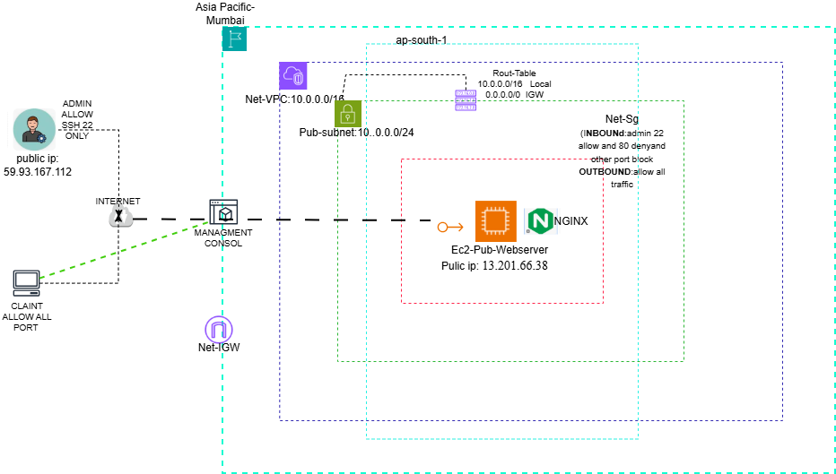

# Secure AWS Public Web Server Architecture using VPC, NACL & Security Groups

### VPC Details

### 🟩 VPC Creation (10.0.0.0/16)

1. Open AWS Console → Search **VPC**.
2. Click **Create VPC**.
3. Choose **VPC Only** option.
4. Enter:
   - Name: My-VPC
   - IPv4 CIDR: 10.0.0.0/16
   - Tenancy: Default
5. Click **Create VPC**.
6. Verify VPC is created with correct CIDR.

### Subnet Details

### 🟦 Subnet Creation (10.0.0.0/24)

1. Go to **VPC → Subnets → Create Subnet**.
2. Select your VPC: **My-VPC**.
3. Enter:
   - Name: Public-Subnet
   - Availability Zone: ap-south-1a (optional)
   - IPv4 CIDR block: 10.0.0.0/24
4. Click **Create Subnet**.
5. Select the subnet → Click **Actions → Edit subnet settings**.
6. Enable **Auto-assign Public IPv4**.

### Route Table

### 🛣️ Route Table Setup (Public-RT)

1. Go to **VPC → Route Tables → Create Route Table**.
2. Enter:
   - Name: Public-RT
   - VPC: My-VPC
3. Click **Create Route Table**.

#### Add Internet Route
4. Open Public-RT → Go to **Routes**.
5. Click **Edit Routes → Add Route**.
   - Destination: **0.0.0.0/0**
   - Target: **Internet Gateway (My-IGW)**
6. Save the route.

#### Associate Subnet
7. Go to **Subnet Associations → Edit**.
8. Select **Public-Subnet**.
9. Save changes.

### Internet Gateway

### EC2 Instance

### NACL Rules

### Nginx Installed ADMIN 

### Client IP Details

### Client Access HTTP 80 in NGINX

